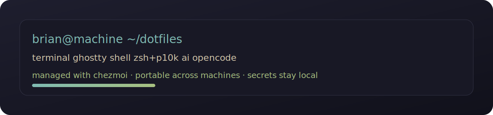

# dotfiles

Portable terminal, shell, and OpenCode setup for Linux machines.




One repo. New machine in minutes. No rebuilding terminal + AI tooling from memory.

## ✦ Active stack

- **Terminal:** Ghostty
- **Shell:** Zsh + Powerlevel10k
- **System info:** Fastfetch
- **AI tooling:** OpenCode + Context7 MCP
- **Dotfiles manager:** chezmoi

## ⚡ Bootstrap

Fresh machine:

```sh
sh -c "$(curl -fsLS https://get.chezmoi.io)" -- init --apply briankeefe
```

Then create local machine data:

```sh
mkdir -p ~/.config/chezmoi ~/.secrets/opencode
chmod 700 ~/.config/chezmoi ~/.secrets ~/.secrets/opencode
$EDITOR ~/.config/chezmoi/chezmoi.toml
```

Minimal example:

```toml
[data]
machine = "personal-laptop"
email = "you@example.com"
work = false
uses_ghostty = true
terminal_font = "FantasqueSansM Nerd Font Mono"
opencode_model = "openai/gpt-5.4"
```

Then restart shell:

```sh
exec zsh
```

## 🖥 Preview

Current focus is clean local-dev ergonomics:

- muted Ghostty palette
- palette-sensitive p10k config
- readable completion + directory colors
- OpenCode global defaults in one place

## 🧠 OpenCode

Global defaults live here:

```text
private_dot_config/opencode/opencode.json.tmpl
private_dot_config/opencode/tui.json
```

Project-specific behavior should stay with each project:

```text
opencode.json
.opencode/agents/
.opencode/commands/
```

## 🔐 Secrets

Secrets never live in git.

Use local files such as:

```text
~/.secrets/opencode/openai_api_key
```

OpenCode config can reference them with:

```json
"{file:~/.secrets/opencode/openai_api_key}"
```

## ✦ Layout

```text
dotfiles/
├── .chezmoi.toml.tmpl
├── .chezmoiignore
├── dot_zshrc.tmpl
├── dot_p10k.zsh
├── private_dot_config/
│   ├── fastfetch/
│   ├── ghostty/
│   └── opencode/
├── private_dot_secrets/
├── docs/
└── run_once_install-packages.sh.tmpl
```

## 🔄 Daily workflow

Update repo + apply changes:

```sh
chezmoi update
```

Review changes:

```sh
chezmoi diff
```

Edit a managed file:

```sh
chezmoi edit ~/.zshrc
chezmoi edit ~/.config/ghostty/theme.conf
chezmoi edit ~/.config/opencode/opencode.json
```

## 🧱 Migration note

This repo still contains older **stow-based** directories from the previous setup.

They are being kept during transition so older configs/history are not lost immediately. The active path forward is **chezmoi** for user-level config that should sync cleanly across machines.

## Why this repo exists

Because rebuilding terminal, prompt, AI tooling, and shell behavior by hand every year is nonsense.
