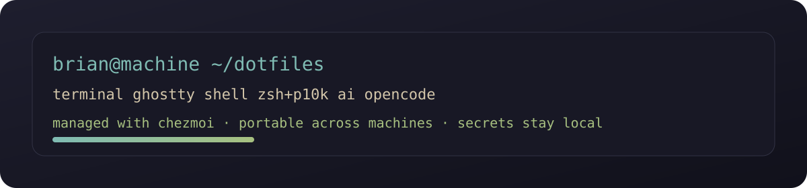

# dotfiles

Personal Mac and Linux configuration, managed with chezmoi. This repository is private.




One repo. New machine in minutes. No rebuilding terminal + AI tooling from memory.

## ✦ Active stack

- **Terminal:** Ghostty
- **Terminal workspaces:** Herdr, with OMP state reporting and workspace naming extensions
- **Mac desktop:** AeroSpace + JankyBorders
- **Shell:** Zsh + Powerlevel10k
- **System info:** Fastfetch
- **AI tooling:** Oh My Pi (omp) + OpenCode + Context7 MCP
- **Dotfiles manager:** chezmoi

## ⚡ Bootstrap

### Mac: restore the terminal and desktop setup

Install [Homebrew](https://brew.sh/) first, then:

```sh
brew install chezmoi gh
gh auth login
gh auth setup-git
chezmoi init https://github.com/briankeefe/dotfiles.git
brew bundle install --no-upgrade --file "$(chezmoi source-path)/macos/Brewfile"
curl -fsSL https://herdr.dev/install.sh | sh
export PATH="$HOME/.local/bin:$HOME/.bun/bin:$PATH"
bun install -g @oh-my-pi/pi-coding-agent
```

The Brewfile covers daily apps, terminal tools, and the tracked shell's Homebrew
dependencies, including the four **MesloLGS NF** font faces via
`font-meslo-for-powerlevel10k`. It intentionally omits database servers, ML stacks,
alternate browsers, and overlapping menu-bar utilities. Herdr stays on its direct
installer because Homebrew installs do not support preview-channel updates.
Review the Brewfile before installing; already-installed apps outside Homebrew
may need to be omitted locally if Homebrew reports an existing application.
This is a package list, not a version lock. `--no-upgrade` avoids upgrading
already-installed packages.

Keep `~/.local/bin` and `~/.bun/bin` on your shell's PATH. The repo's Zsh
template already includes them, but restoring your shell is optional.

Preview and apply only the Mac desktop and OMP config. This leaves your shell,
other tools, existing sessions, and credentials alone:

```sh
chezmoi diff ~/.aerospace.toml ~/.config/ghostty ~/.config/herdr ~/.config/borders ~/.config/aerospace ~/.omp
chezmoi apply --parent-dirs --exclude scripts ~/.aerospace.toml ~/.config/ghostty ~/.config/herdr ~/.config/borders ~/.config/aerospace ~/.omp
bun install --cwd ~/.omp/plugins --frozen-lockfile --ignore-scripts
herdr channel set preview
brew services start borders
open -a AeroSpace
```

Grant AeroSpace Accessibility permission when prompted. macOS preferences are
separate and opt-in:

```sh
sh "$(chezmoi source-path)/macos/defaults.sh"
```

This restores dark mode, Dock auto-hide and size, the three configured hot corners,
natural scrolling, selected built-in trackpad gestures, and frees Cmd-Ctrl-D for
DataGrip. Log out and back in afterward. It does not replace Dock app lists,
other keyboard shortcuts, or device-specific preferences, and does not run during
`chezmoi apply`.

Open Ghostty, run `herdr`, then run `omp` inside a Herdr pane. Authenticate OMP
providers and MCP services on the new machine; credentials are not stored here.
The Herdr installer and preview channel install current releases, not a pinned
copy of the old binary. See [Herdr installation](https://herdr.dev/docs/install/).

Captured setup:

| Component | Settings |
| --- | --- |
| Ghostty | TokyoNight Night, `08080f` background, 16pt font, native tab shortcuts disabled |
| Herdr | Tokyo Night, spaces ordering, pane labels, Kitty graphics, preview updates |
| Agent cycling | PageUp/PageDown in Ghostty sends Herdr's Ctrl-Alt-`[` / `]` |
| AeroSpace | 8px gaps; Ghostty=1, Slack=2, DataGrip=3, Chrome=4, strays=5 |
| Window controls | Cmd-Ctrl-H/J/K/L focus; Cmd-Ctrl-G/S/D/C summon; Cmd-Ctrl-R reset |
| OMP | Current model roles, Titanium theme, compact status line, Mnemopi preferences, Herdr extensions |

This restores configuration, not a disk image: app logins, API keys, databases,
OMP memories/history, Herdr sessions, and local project checkouts stay outside git.

### Mac: optional shell restoration

The Mac shell template targets Apple Silicon Homebrew (`/opt/homebrew`), matching
the source machine. After installing the Brewfile, install Oh My Zsh and its
Powerlevel10k theme if those directories don't already exist:

```sh
test -d ~/.oh-my-zsh || git clone --depth=1 https://github.com/ohmyzsh/ohmyzsh.git ~/.oh-my-zsh
test -d ~/.oh-my-zsh/custom/themes/powerlevel10k || git clone --depth=1 https://github.com/romkatv/powerlevel10k.git ~/.oh-my-zsh/custom/themes/powerlevel10k
mkdir -p ~/.nvm
chezmoi diff ~/.zshrc ~/.p10k.zsh
chezmoi apply --exclude scripts ~/.zshrc ~/.p10k.zsh
exec zsh
```

Keep the Homebrew installer's `brew shellenv` initialization in `~/.zprofile`.
The tracked shell preserves Powerlevel10k, autosuggestions, syntax highlighting,
autojump, nvm, pyenv, Java 17, local binary paths, and the OpenCode wrapper.
It also matches the live Mac's `omp` alias: update first, launch only if the
update succeeds. Use `command omp` to skip that update when offline.
Node/Python versions and project dependencies are still installed per project.

The Meslo fonts are installed, not forced into Ghostty: its current config leaves
the font family at the terminal default. Local shell secrets belong in
`~/.secrets/shell/env.zsh`, never in the tracked template.

### Linux / full configuration

Authenticate GitHub before cloning this private repo:

```sh
gh auth login
gh auth setup-git
chezmoi init https://github.com/briankeefe/dotfiles.git
chezmoi diff
chezmoi apply
```

Default Arch-safe machine data is included so first apply does not stop on
missing template values. Override it when needed:

Minimal example:

```toml
[data]
machine = "personal-laptop"
email = "you@example.com"
work = false
uses_ghostty = true
terminal_font = "FantasqueSansM Nerd Font Mono"
opencode_model = "openai/gpt-5.4"
```

Then restart shell:

```sh
exec zsh
```

## 🖥 Preview

Current focus is clean local-dev ergonomics:

- muted Ghostty palette
- palette-sensitive p10k config
- readable completion + directory colors
- OpenCode global defaults in one place

## 🧠 OpenCode

Global defaults live here:

```text
private_dot_config/opencode/opencode.json.tmpl
private_dot_config/opencode/tui.json
```

Project-specific behavior should stay with each project:

```text
opencode.json
.opencode/agents/
.opencode/commands/
```

## 🤖 Oh My Pi

Oh My Pi (`omp`) is the coding agent. It installs via Bun and stores global
config in `~/.omp`.

### Install

On Arch Linux, bootstrap prepends `~/bin`, `~/.local/bin`, `~/.bun/bin`, and
`~/.opencode/bin` to shell `PATH`, installs Bun when missing, then installs OMP:

```sh
bun install -g @oh-my-pi/pi-coding-agent
```

This puts the `omp` binary on your PATH (`~/.bun/bin/omp`). Verify:

```sh
omp --version
```

Upgrade later with `omp update`.

### Apply configs

`chezmoi apply` (or the bootstrap above) lays the tracked config into `~/.omp`:

```text
private_dot_omp/agent/config.yml          # model roles, theme, memory backend
private_dot_omp/agent/mcp.json            # MCP server toggles
private_dot_omp/agent/commands/           # custom slash commands
private_dot_omp/agent/rules/              # always-apply rules
private_dot_omp/agent/extensions/         # Herdr state reporting and workspace naming
private_dot_omp/agent/skills/             # custom skills (execute toolkit)
private_dot_omp/plugins/                  # plugin manifest
```

Only durable, hand-authored config is tracked. Runtime state stays local and is
never committed: `*.db*`, `blobs/`, `sessions/`, `terminal-sessions/`,
`memories/` (mnemopi), `cache/`, `logs/`, and `plugins/node_modules/`.

### Plugins

Enabled: `@baylarsadigov/omp-undo-redo`, `@dietrichgebert/ponytail`, and
`pi-committer`. `pi-rewind` is installed but disabled. Restore their pinned
dependencies after applying the configs:

```sh
bun install --cwd ~/.omp/plugins --frozen-lockfile --ignore-scripts
```

Manage plugins with the CLI:

```sh
omp plugin list
omp plugin install <package>
omp plugin uninstall <package>
```

`package.json` and `bun.lock` capture installed packages;
`omp-plugins.lock.json` preserves enable/disable state. `pi-committer` was active
on the source Mac but missing from its manifest, so it is explicitly included
here at the installed version, `0.12.8`.

The Herdr state extension uses `HERDR_SOCKET_PATH` from its parent pane.
Run OMP inside Herdr for sidebar state and workspace naming. Herdr may regenerate
its managed state extension during upgrades; refresh the snapshot after upgrading.
The completion sound extension is kept as `ding.ts.disabled`. If restoring over
an older dotfiles install, disable or remove its existing `ding.ts` manually;
chezmoi does not delete untracked destination files.

## 🔐 Secrets

Secrets never live in git.

Use local files such as:

```text
~/.secrets/opencode/openai_api_key
```

OpenCode config can reference them with:

```json
"{file:~/.secrets/opencode/openai_api_key}"
```

## ✦ Layout

```text
dotfiles/
├── .chezmoi.toml.tmpl
├── .chezmoiignore
├── dot_zshrc.tmpl
├── dot_p10k.zsh
├── private_dot_config/
│   ├── fastfetch/
│   ├── ghostty/
│   ├── herdr/
│   └── opencode/
├── private_dot_omp/
│   ├── agent/
│   └── plugins/
├── private_dot_secrets/
├── docs/
└── run_once_install-packages.sh.tmpl
```

## 🔄 Daily workflow

Update repo + apply changes:

```sh
chezmoi update
```

Review changes:

```sh
chezmoi diff
```

Edit a managed file:

```sh
chezmoi edit ~/.zshrc
chezmoi edit ~/.config/ghostty/config
chezmoi edit ~/.config/opencode/opencode.json
```

## 🧱 Migration note

This repo still contains older **stow-based** directories from the previous setup.

They are being kept during transition so older configs/history are not lost immediately. The active path forward is **chezmoi** for user-level config that should sync cleanly across machines.

## Why this repo exists

Because rebuilding terminal, prompt, AI tooling, and shell behavior by hand every year is nonsense.
